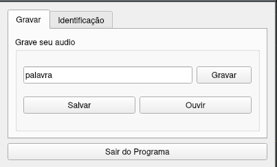
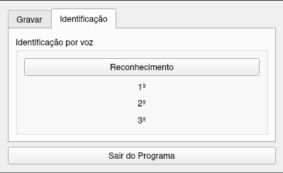
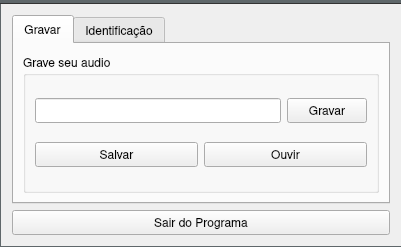

# Final_SpeechRecognition

**Conteúdo da Disciplina**: Trabalho final<br>

## Alunos
|Matrícula | Aluno |
| -- | -- |
| 16/0049733  |  Felipe Borges de Souza Chaves |
| 18/0055241  |  Victor Jorge da Silva Gonçalves |

## Sobre 

### Aspectos gerais
Este projeto implementa um aplicativo _desktop_ cujo proposito é o reconhecimento de fala. O aplicativo é criado em [_Python_](https://www.python.org/) e é munido de _funcionalidades_ para registro de novas palavras e consultas sobre o _dataset_ de palavras. O usuário do aplicativo cadastra uma nova palavra através do envio de sua _string_ e seu áudio correspondente. O usuário do aplicativo pode então enviar um áudio de **uma palavra** para o campo de consulta e receber de volta a sua _string_ correspondente. Para que uma palavra seja reconhecida, a mesma deve ser previamente cadastrada.

### Reconhecimento de fala
O reconhecimento de fala é feito através da comparação de um áudio, que não se sabe _a priori_ a que palavra se refere, com todas as outras palavras cadastradas anteriormente, e retornando assim aquela cuja diferença for a menor. A rotina de comparação de áudio é composta de duas etapas:

1. **Extração dos atributos Mel-Frequency Cepstral Coefficients** <br>
 Faz-se uma análise de características espectrais de tempo curto, baseando-se no uso do espectro da voz convertido para uma escala de frequências denominada MEL que é uma escala que visa imitar as características únicas perceptíveis pelo ouvido humano (MFCC).

2. **Comparação entre os atributos MFCC de cada palavra** <br>
 Utilizando o algoritmo [_Dynamic Time Warping_](https://pt.wikipedia.org/wiki/Dynamic_time_warping) (DTW) que utiliza de técnicas de programação dinâmica para computar um melhor _match_ de duas sequências, conseguimos descobrir qual é a palavra mais próxima do áudio fornecido para consulta. Nesta API, em específico, estaremos utilizando uma versão aproximada do DTW chamada _Fast DTW_ que possui complexidade linear, mas que para os nosso proposito se mostrou extremamente eficiente.

## Screenshots





## Instalação 
**Linguagem**: Python 3<br>
**Framework**: [Qt](https://doc.qt.io/qtforpython/)<br>

É altamente aconselhavel que você utilize uma [virtualenv](https://virtualenv.pypa.io/en/latest/installation.html) e 
instale as dependências neste ambiente.

Com a virtualenv ligada instale as dependências com o comando abaixo:

```bash
pip3 install -r requirements.txt
```

Descreva os pré-requisitos para rodar o seu projeto e os comandos necessários.

## Uso 

No ambiente com os pacotes instalados execute o comando no *root* do projeto:

```bash
python3 main.py
```

## Outros 
Quaisquer outras informações sobre seu projeto podem ser descritas abaixo.


